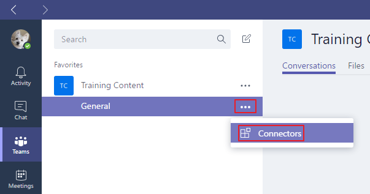
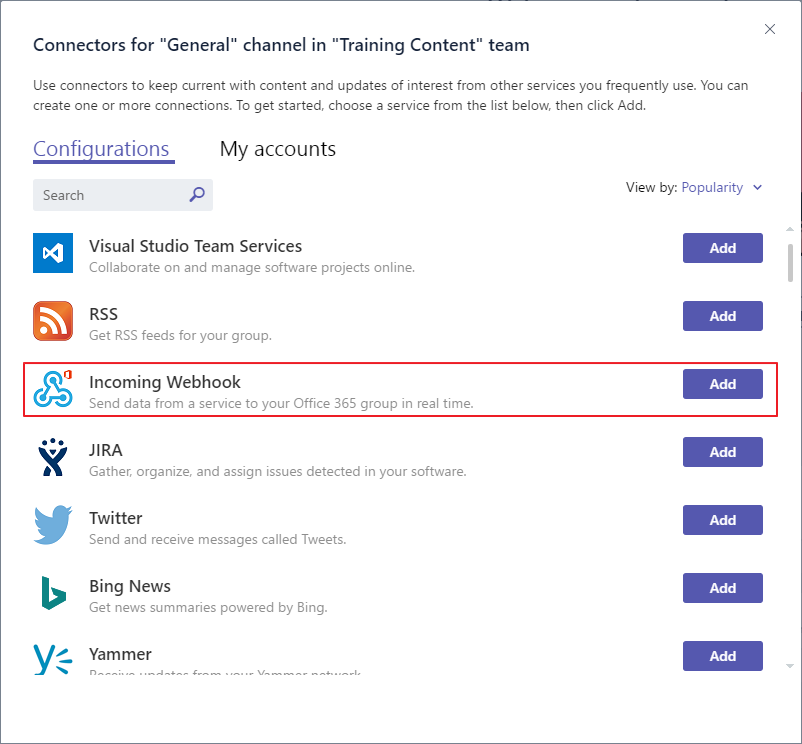
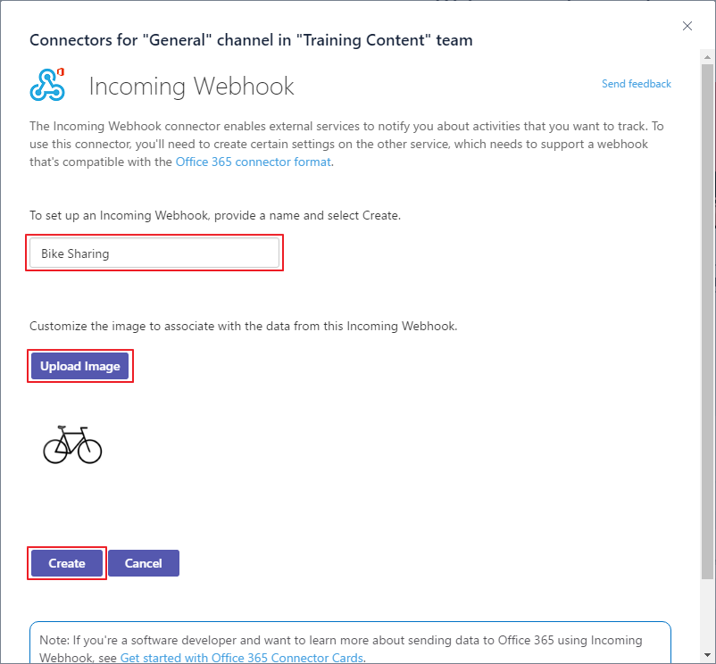
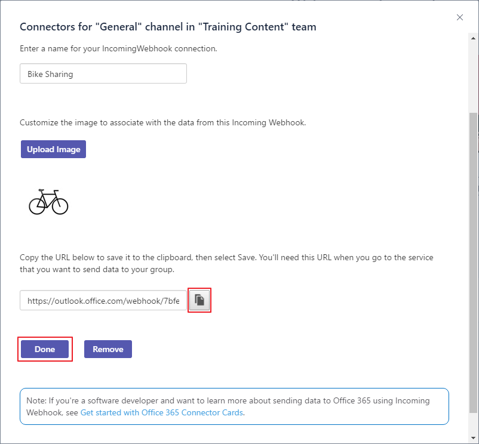
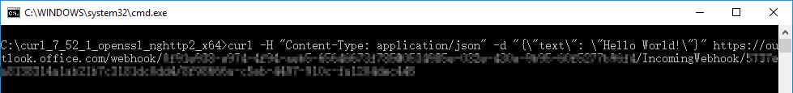
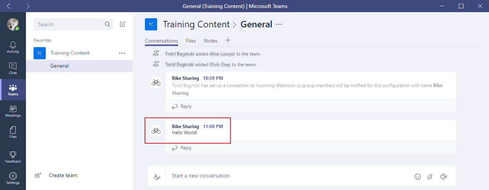

# Create Office 365 Connectors for Microsoft Teams (preview) #
Office 365 Connectors are a great way to get useful information and content into Microsoft Teams. Any user can connect their team to services like Trello, GitHub, Bing News, Twitter, etc., and get notified of the team's activity in that service. From tracking a team's progress in Trello, to following important hashtags in Twitter, Office 365 Connectors make it easier for your team to stay in sync and get more done.

Office 365 Connectors also provide a way for developers to integrate with Microsoft Teams by building custom incoming webhooks Connectors to generate rich cards within channels.

## Prerequisites ##
1. You must have an Office 365 tenant and Windows Azure subscription to complete this lab. If you do not have one, the lab for **O3651-7 Setting up your Developer environment in Office 365** shows you how to obtain a trial.
2. You must turn on Microsoft Teams for your organization.
   - Follow the instructions in this link [https://msdn.microsoft.com/en-us/microsoft-teams/setup](https://msdn.microsoft.com/en-us/microsoft-teams/setup)
3. You must have Microsoft Teams installed.
   - Download it at this link [https://teams.microsoft.com/downloads](https://teams.microsoft.com/downloads).
4. You must have curl installed.
   - Download it at this link [https://curl.haxx.se/download.html](https://curl.haxx.se/download.html).
   
## Exercise: Create a custom incoming webhook Connector for Microsoft Teams ##
In this exercise, you will create an **Incoming Webhook** connector and send an HTTP request to the webhook address to create Connector Card messages.

In the [02 Tabs](../02 Tabs) Team training module, you will create more complex Connector Card messages with code.

### Add an Incoming Webhook Connector to a channel ###
1. Open **Microsoft Teams** and sign in.
2. Click **Teams** in the left panel, then select a Team. 
3. Select the **General** Channel in the selected team.
4. Click **...** next to the channel name, then select **Connectors**.

	

5. Select **Incoming Webhook** from the list, then click **Add**.

	

6. Enter a name for the webhook, upload an image to associate with the data from the webhook, then select **Create**.

	

7. Click the button next to the webhook URL to copy it.  (You will use the webhook URL in a subsequent step.) 
8. Click **Done**.

	

8. Close the **Connectors** dialog.

### Create a simple Connector Card message to the webhook ###
1. Open a **command prompt** window, go to the directory that contains the **curl.exe**, and enter the following command:

	````shell
	curl -H "Content-Type: application/json" -d "{\"text\": \"Hello World!\"}" <YOUR WEBHOOK URL>
	````

	

	> **Note:** Replace **&lt;YOUR WEBHOOK URL&gt;** with the webhook URL you saved when you created the **Incoming Webhook** connector.

2. When the POST succeeds, you will see a simple 1 outputted by curl.
3. Check the Cobersations tab in the Microsoft Teams application. You will see the new  card message posted to the conversation.

	

Congratulations! You have created an **Incoming Webhook** Connector and sent a simple card message to it.