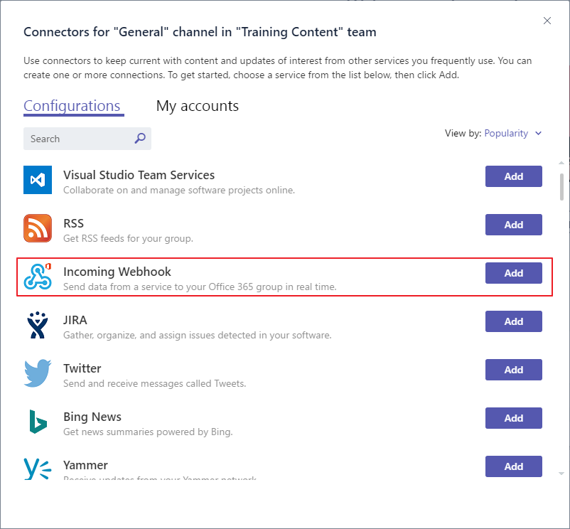
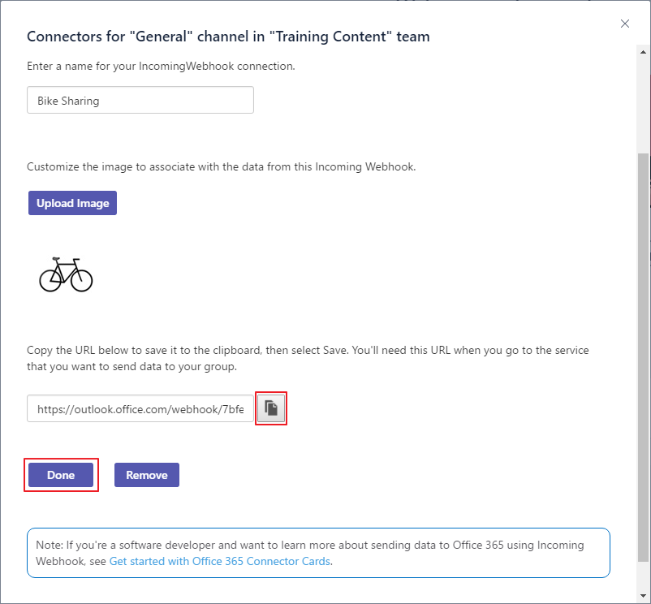
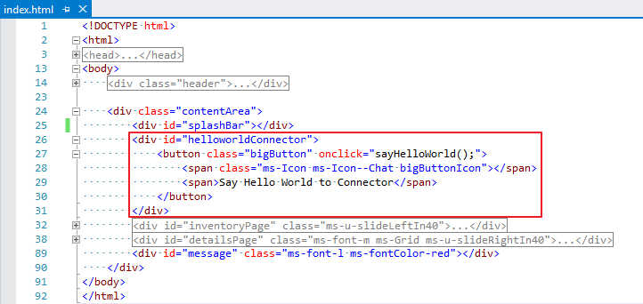
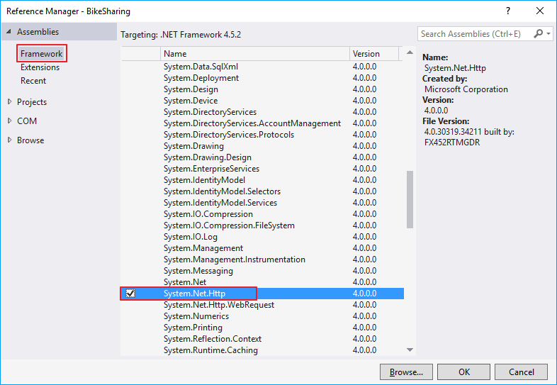
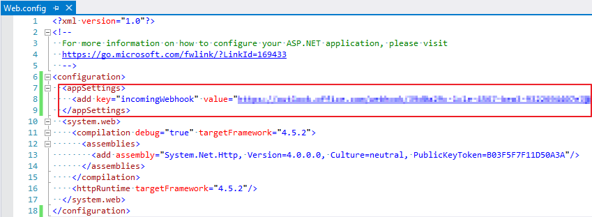
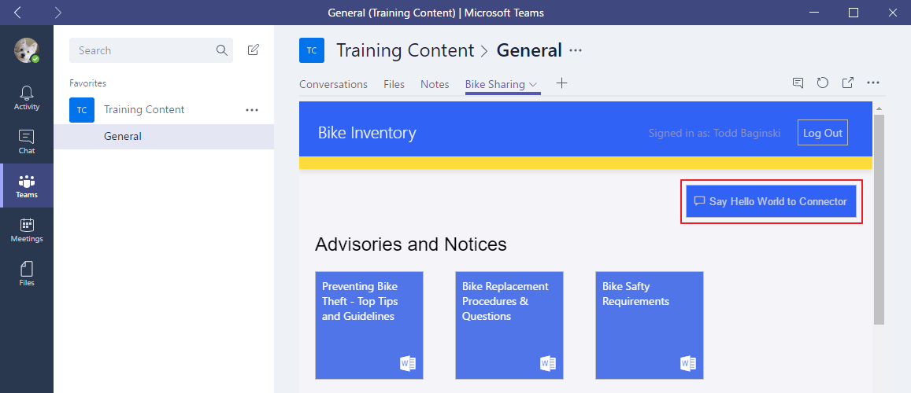
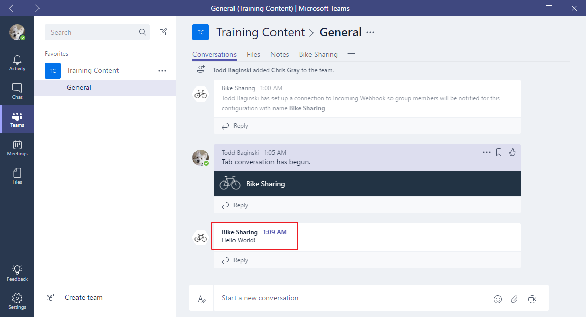
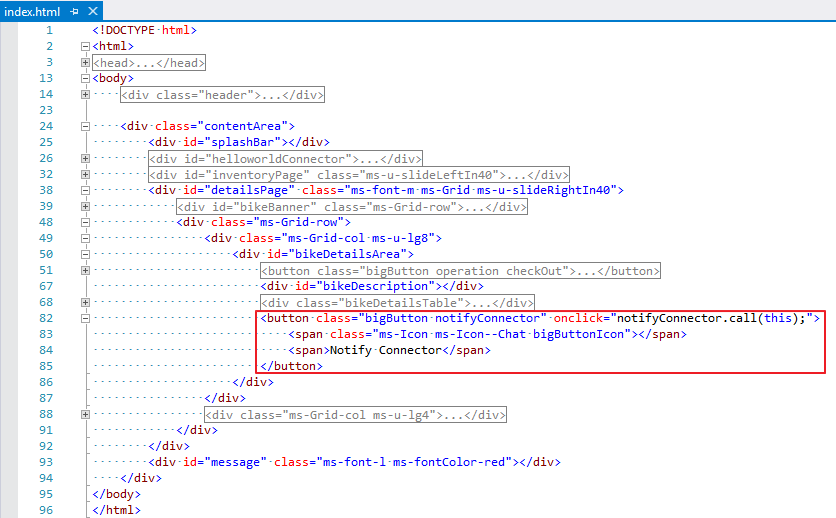
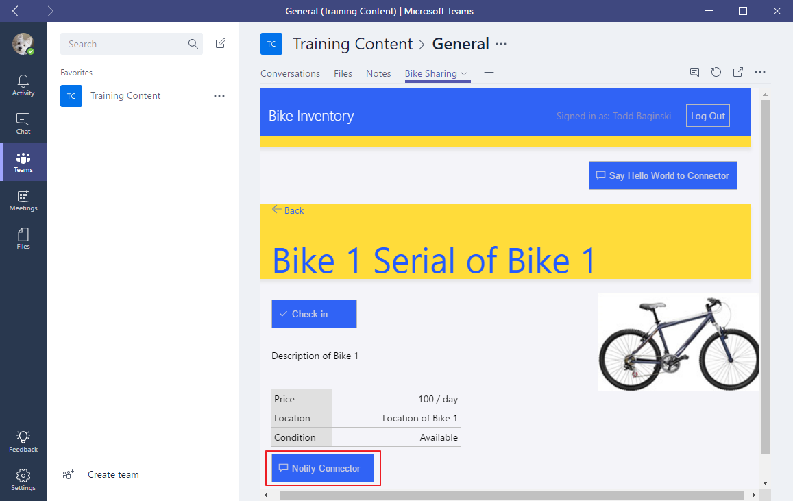
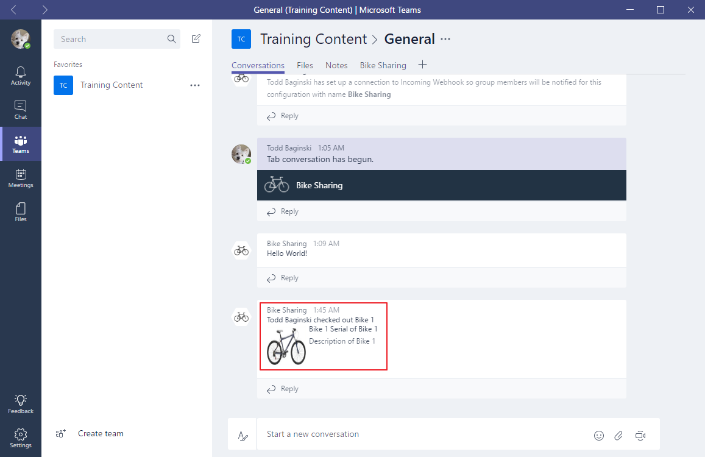

# Create Office 365 Connectors for Microsoft Teams (preview) #
Office 365 Connectors are a great way to get useful information and content into Microsoft Teams. Any user can connect their team to services like Trello, GitHub, Bing News, Twitter, etc., and get notified of the team's activity in that service. From tracking a team's progress in Trello, to following important hashtags in Twitter, Office 365 Connectors make it easier for your team to stay in sync and get more done.

Office 365 Connectors also provide a way for developers to integrate with Microsoft Teams by building custom incoming webhooks Connectors to generate rich cards within channels.

## Prerequisites ##
1. You must have an Office 365 tenant and Windows Azure subscription to complete this lab. If you do not have one, the lab for **O3651-7 Setting up your Developer environment in Office 365** shows you how to obtain a trial.
2. You must turn on Microsoft Teams for your organization.
   - Follow the instructions in this link [https://msdn.microsoft.com/en-us/microsoft-teams/setup](https://msdn.microsoft.com/en-us/microsoft-teams/setup)
3. You must have Microsoft Teams installed.
   - Download it at this link [https://teams.microsoft.com/downloads](https://teams.microsoft.com/downloads).
4. You must have curl installed.
   - Download it at this link [https://curl.haxx.se/download.html](https://curl.haxx.se/download.html).
   
## Exercise 1: Create a custom Incoming Webhook Connector for Microsoft Teams ##
In this exercise, you will create an **Incoming Webhook** connector and send an HTTP request to the webhook address to create Connector Card messages.

In the [02 Tabs](../02 Tabs) Team training module, you will create more complex Connector Card messages with code.

### Add an Incoming Webhook Connector to a channel ###
1. Open **Microsoft Teams** and sign in.
2. Click **Teams** in the left panel, then select a Team. 
3. Select the **General** Channel in the selected team.
4. Click **...** next to the channel name, then select **Connectors**.

	

5. Select **Incoming Webhook** from the list, then click **Add**.

	

6. Enter a name for the webhook, upload an image to associate with the data from the webhook, then select **Create**.

	

7. Click the button next to the webhook URL to copy it.  (You will use the webhook URL in a subsequent step.) 
8. Click **Done**.

	

8. Close the **Connectors** dialog.

### Create a simple Connector Card message to the webhook ###
1. Open a **command prompt** window, go to the directory that contains the **curl.exe**, and enter the following command:

	````shell
	curl -H "Content-Type: application/json" -d "{\"text\": \"Hello World!\"}" <YOUR WEBHOOK URL>
	````

	

	> **Note:** Replace **&lt;YOUR WEBHOOK URL&gt;** with the webhook URL you saved when you created the **Incoming Webhook** connector.

2. When the POST succeeds, you will see a simple 1 outputted by curl.
3. Check the Cobersations tab in the Microsoft Teams application. You will see the new  card message posted to the conversation.

	

Congratulations! You have created an **Incoming Webhook** Connector and sent a simple card message to it.

## Exercise 2: Send a Hello World card message to the Incoming Webhook Connector ##

**Prerequisites:**  In order to do this exercise you must first complete exercise 1 in the [Teams - 01 Tabs](../Teams/01 Tabs/Lab.md) training module.

### Add a button to send a Hello World card message to the Incoming Webhook Connector ###

The steps in this lab exercise are performed on the code created in exercise 1 in the [Teams - 01 Tabs](../Teams/01 Tabs/Lab.md) training module.
 
1. Open the file **index.html**, add the following code after the line `<div id="splashBar"></div>`, then save the file.

	````html
	<div id="helloworldConnector">
	    <button class="bigButton" onclick="sayHelloWorld();">
	        <span class="ms-Icon ms-Icon--Chat bigButtonIcon"></span>
	        <span>Say Hello World to Connector</span>
	    </button>
	</div>
	````

	

2. Open the file **main.css**, add the CSS style `margin-top:20px;` to the CSS selector `#bikeBanner`.
3. Add the following code, then save the file.

	````css
	/* hello world connector */
	#helloworldConnector:after{content:""; display:block; clear:both}
	#helloworldConnector .bigButton{float:right; width:auto; margin:20px 20px 0 0}
	````

	

4. Open the file **main.js**, add a key value pair `connector: window.location.origin + "/connector.ashx"` to the definition of `window.appConfig`.

	

5. Add the following code, then save the file.

	````javascript
	// send a hello world message to a Microsoft Teams Connector.
	function sayHelloWorld() {
	    sendConnectorMessage({ "text": "Hello World!" });
	}
	
	// send a Card message to a Microsoft Teams Connector.
	// if it succeeded, the cb will be called.
	// if it failed, the error message will be shown.
	function sendConnectorMessage(message, cb) {
	    $.ajax({
	        type: "GET",
	        url: window.appConfig.connector,
	        contentType: "application/json",
	        data: message
	    }).done(function (response) {
	        if (typeof cb === "function") {
	            cb();
	        }
	    }).fail(function (response) {
	        $("#message").html("Send Connector Message Failed: " + JSON.stringify(response));
	    });
	}
	````

### Add a generic handler to send the Hello World card message to the Incoming Webhook Connector ###
1. In the **Solution Explorer**, right click the project and select **Add | Add New Item**.
2. In the **Add New Item** dialog, select **Visual C#** in the left panel, then select **Generic Handler**, enter **connector.ashx** in the **Name** textbox, then click the **Add** button.
3. In the **Solution Explorer**, right click the project and select **Add | Reference**.
4. In the **Reference Manager** dialog, select **Assemblies | Framework** in the left panel, select **System.Net.Http**, then click **OK**.

	

5. Open the file **connector.ashx**, replace the content with the following code, then save the file. 

	````cs
	<%@ WebHandler Language="C#" Class="Connector" %>
	
	using System;
	using System.Web;
	using System.Net.Http;
	using System.Configuration;
	using System.Threading.Tasks;
	
	public class Connector : HttpTaskAsyncHandler {
	
	    public override bool IsReusable {
	        get {
	            return false;
	        }
	    }
	
	    public override Task ProcessRequestAsync(HttpContext context) {
	        var client = new HttpClient();
	        var url = ConfigurationManager.AppSettings["incomingWebhook"];
	        var queryString = context.Request.QueryString;
	        var message = "{\"text\": \"" + queryString["text"] + "\"}";
	        var body = new StringContent(message, System.Text.Encoding.UTF8, "application/json");
	        return client.PostAsync(url, body);
	    }
	}
	````

6. Open the file **Web.config**, add the following code inside the **configuration** node, then save the file. 

	````xml
	<appSettings>
	  <add key="incomingWebhook" value="<INCOMING WEBHOOK URL>" />
	</appSettings>
	````

	

	> **Note:** Please replace the **&lt;INCOMING WEBHOOK URL&gt;** placeholder with the incoming webhook connector's URL generated in the  [01 Connectors](../01 Connectors/Lab.md) module.

### Publish the web site to Azure and review the tab in Microsoft Teams ###
1. Publish the web site to the Azure Web App the same way you did in Exercise 1.
2. Switch to the **Microsoft Teams** application, select the Team, select the the **General** channel, then click the **Bike Sharing** tab to see the updated tab.

	

	> **Note:** If you can't see the Say Hello World to Connector button, please sign out of Microsoft Teams and sign in again.

3. Click the **Say Hello World to Connector** button.
4. Click the **Conversations** tab, and you will see the **Hello World!** message.

	

## Exercise 3: Send a complex card message to the Incoming Webhook Connector ##

**Prerequisites:**  In order to do this exercise you must first complete exercise 2 in this training module.

### Add a button to send a card message to the connector when a bike is checked out or checked in ###
1. Open the file **index.html**, add the following code after the element `<div class="bikeDetailsTable">`, then save the file.

	````html
	<button class="bigButton notifyConnector" onclick="notifyConnector.call(this);">
	    <span class="ms-Icon ms-Icon--Chat bigButtonIcon"></span>
	    <span>Notify Connector</span>
	</button>
	````

	

2. Open the file **main.css**, add the following code, then save the file.

	````css
	/* notify connector button */
	.bigButton.notifyConnector{width:150px; display:none}
	````

3. Open the file **main.js**, update the function **bikeAction** to match the following code.

	````javascript
	function bikeAction() {
	    var jElement = $(this);
	    if (jElement.hasClass("wait")) {
	        return;
	    }
	
	    var isCheckOut = jElement.hasClass("checkOut");
	    jElement.removeClass("checkOut checkIn").addClass("wait");
	    $(".notifyConnector").hide();
	    window.setTimeout(bikeActionCompleted.bind(jElement, isCheckOut), 1200);
	}
	````

4. Update the function **bikeActionCompleted** to match the following code.

	````javascript
	function bikeActionCompleted(isCheckOut) {
	    this.removeClass("wait").addClass(isCheckOut ? "checkIn" : "checkOut");
	    this.closest("#detailsPage").data("lastAction", isCheckOut ? "checked out" : "checked in");
	    $(".notifyConnector").show();
	}
	````

5. Add the following code, then save the file.

	````javascript
	// send a Card message to a Microsoft Teams Connector to notify the last action for the bike.
	function notifyConnector() {
	    var container = $(this).closest("#detailsPage");
	    var lastAction = container.data("lastAction");
	    var bike = container.data("bike");
	    if (lastAction && bike) {
	        var message = {
	            "text": getUserName() + " " + lastAction + " " + bike.columnSet.Title,
	            "activityTitle": bike.columnSet.Title + " " + bike.columnSet.Serial,
	            "activityText": bike.columnSet.Description,
	            "activityImage": bike.columnSet.Picture.Url
	        };
	        sendConnectorMessage(message, function () {
	            container.data("lastAction", "");
	            $(".notifyConnector").hide();
	        })
	    }
	}
	````

### Update the generic handler to send a more complex card message to the Incoming Webhook Connector ###
Open the file **connector.ashx**, replace the method **ProcessRequestAsync** with the following code, then save the file. 

````cs
public override Task ProcessRequestAsync(HttpContext context) {
    var client = new HttpClient();
    var url = ConfigurationManager.AppSettings["incomingWebhook"];
    var queryString = context.Request.QueryString;
    var message = "{\"text\": \"" + queryString["text"] + "\",\"sections\": [{\"activityTitle\": \"" + queryString["activityTitle"] + "\",\"activityText\": \"" + queryString["activityText"] + "\",\"activityImage\": \"" + queryString["activityImage"] + "\"}]}";
    var body = new StringContent(message, System.Text.Encoding.UTF8, "application/json");
    return client.PostAsync(url, body);
}
````

### Publish the web site to Azure and review the tab in Microsoft Teams ###
1. Publish the web site to Azure Web App the same way you did in Exercise 1.
2. Switch to the **Microsoft Teams** application, select the Team, select the **General** channel, then click the **Bike Sharing** tab.
3. Click a bike, the details of the bike are shown. Click the **Check out** button and a **Notify Connector** button appears.

	

4. Click the **Notify Connector** button, then go to the **Conversations** tab where you will see a card message that displays the previous action taken on the bike.

	>**Note:** If the previous action you took on the bike was clicking the **Check In** button, then the card message will indicate the bike was checked in after you click the **Notify Connector** button.
	
	